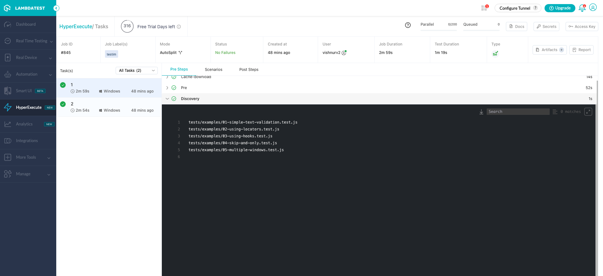
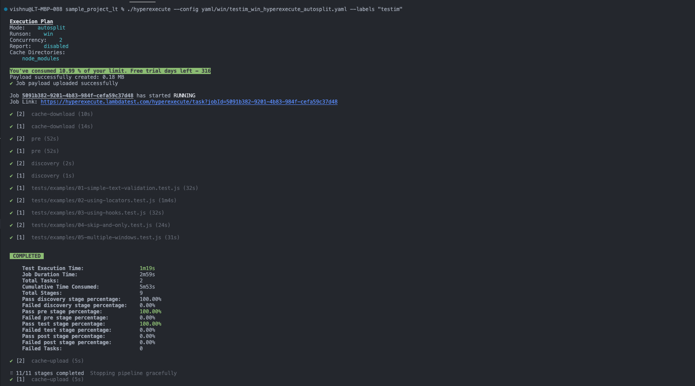
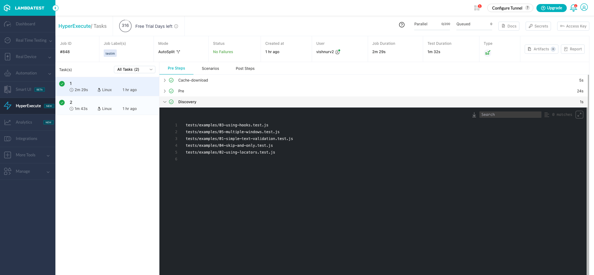

HyperExecute is a smart test orchestration platform to run end-to-end Selenium tests at the fastest speed possible. HyperExecute lets you achieve an accelerated time to market by providing a test infrastructure that offers optimal speed, test orchestration, and detailed execution logs.

The overall experience helps teams test code and fix issues at a much faster pace. HyperExecute is configured using a YAML file. Instead of moving the Hub close to you, HyperExecute brings the test scripts close to the Hub!

- <b>HyperExecute HomePage</b>: https://www.lambdatest.com/hyperexecute
- <b>Lambdatest HomePage</b>: https://www.lambdatest.com
- <b>LambdaTest Support</b>: [support@lambdatest.com](mailto:support@lambdatest.com)

To know more about how HyperExecute does intelligent Test Orchestration, do check out [HyperExecute Getting Started Guide](https://www.lambdatest.com/support/docs/getting-started-with-hyperexecute/)

[](https://hyperexecute.lambdatest.com/?utm_source=github&utm_medium=repository&utm_content=java&utm_term=testim)

## Gitpod

Follow the below steps to run Gitpod button:

1. Click '**Open in Gitpod**' button (You will be redirected to Login/Signup page).
2. Login with Lambdatest credentials and it will be redirected to Gitpod editor in new tab and current tab will show hyperexecute dashboard.

## [](https://hyperexecute.lambdatest.com/hyperexecute?type=gitpod&framework=testim)

<!---If logged in, it will be redirected to Gitpod editor in new tab where current tab will show hyperexecute dashboard.

If not logged in, it will be redirected to Login/Signup page and simultaneously redirected to Gitpod editor in a new tab where current tab will show hyperexecute dashboard.

If not signed up, you need to sign up and simultaneously redirected to Gitpod in a new tab where current tab will show hyperexecute dashboard.--->

# How to run Automation tests on HyperExecute (using Testim)

- [Pre-requisites](#pre-requisites)

  - [Download HyperExecute CLI](#download-hyperexecute-cli)
  - [Configure Environment Variables](#configure-environment-variables)

- [Auto-Split Execution with Testim](#auto-split-execution-with-testim)

  - [Core](#core)
  - [Pre Steps and Dependency Caching](#pre-steps-and-dependency-caching)
  - [Post Steps](#post-steps)
  - [Artifacts Management](#artifacts-management)
  - [Test Execution](#test-execution)

- [Matrix Execution with testim](#matrix-execution-with-testim)

  - [Core](#core-1)
  - [Pre Steps and Dependency Caching](#pre-steps-and-dependency-caching-1)
  - [Post Steps](#post-steps-1)
  - [Artifacts Management](#artifacts-management-1)
  - [Test Execution](#test-execution-1)

- [Secrets Management](#secrets-management)
- [Navigation in Automation Dashboard](#navigation-in-automation-dashboard)

# Pre-requisites

Before using HyperExecute, you have to download HyperExecute CLI corresponding to the host OS. Along with it, you also need to export the environment variables _LT_USERNAME_ and _LT_ACCESS_KEY_ that are available in the [LambdaTest Profile](https://accounts.lambdatest.com/detail/profile) page.

## Download HyperExecute CLI

HyperExecute CLI is the CLI for interacting and running the tests on the HyperExecute Grid. The CLI provides a host of other useful features that accelerate test execution. In order to trigger tests using the CLI, you need to download the HyperExecute CLI binary corresponding to the platform (or OS) from where the tests are triggered:

Also, it is recommended to download the binary in the project's parent directory. Shown below is the location from where you can download the HyperExecute CLI binary:

- Mac: https://downloads.lambdatest.com/hyperexecute/darwin/hyperexecute
- Linux: https://downloads.lambdatest.com/hyperexecute/linux/hyperexecute
- Windows: https://downloads.lambdatest.com/hyperexecute/windows/hyperexecute.exe

## Configure Environment Variables

Before the tests are run, please set the environment variables LT_USERNAME & LT_ACCESS_KEY from the terminal. The account details are available on your [LambdaTest Profile](https://accounts.lambdatest.com/detail/profile) page.

For macOS:

```bash
export LT_USERNAME=LT_USERNAME
export LT_ACCESS_KEY=LT_ACCESS_KEY
```

For Linux:

```bash
export LT_USERNAME=LT_USERNAME
export LT_ACCESS_KEY=LT_ACCESS_KEY
```

For Windows:

```bash
set LT_USERNAME=LT_USERNAME
set LT_ACCESS_KEY=LT_ACCESS_KEY
```

## Auto-Split Execution with testim

Auto-split execution mechanism lets you run tests at predefined concurrency and distribute the tests over the available infrastructure. Concurrency can be achieved at different levels - file, module, test suite, test, scenario, etc.

For more information about auto-split execution, check out the [Auto-Split Getting Started Guide](https://www.lambdatest.com/support/docs/getting-started-with-hyperexecute/#smart-auto-test-splitting)

### Core

Auto-split YAML file (_yaml/testim_win_hyperexecute_autosplit_.yaml\_) in the repo contains the following configuration:

```yaml
globalTimeout: 150
testSuiteTimeout: 150
testSuiteStep: 150
```

Global timeout, testSuite timeout, and testSuite timeout are set to 150 minutes.

The _runson_ key determines the platform (or operating system) on which the tests are executed. Here we have set the target OS as Windows.

```yaml
runson: win
```

Auto-split is set to true in the YAML file.

```yaml
 autosplit: true
```

_retryOnFailure_ is set to true, instructing HyperExecute to retry failed command(s). The retry operation is carried out till the number of retries mentioned in _maxRetries_ are exhausted or the command execution results in a _Pass_. In addition, the concurrency (i.e. number of parallel sessions) is set to 4.

```yaml
retryOnFailure: true
maxRetries: 5
concurrency: 4
```

### Pre Steps and Dependency Caching

Dependency caching is enabled in the YAML file to ensure that the package dependencies are not downloaded in subsequent runs. The first step is to set the Key used to cache directories. The directory _m2_cache_dir_ is created in the project's root directory.

```yaml
# Dependency caching for Windows
cacheKey: '{{ checksum "package.json" }}'
cacheDirectories:
  - node_modules
```

Steps (or commands) that must run before the test execution are listed in the _pre_ run step. In the example, the Maven packages are downloaded in the _m2_cache_dir_. To prevent test execution at the _pre_ stage, the _maven.test.skip_ parameter is set to _true_ so that only packages are downloaded and no test execution is performed.

```yaml
pre:
  - npm i @testim/testim-cli -g
  - npm install
```

### Post Steps

Steps (or commands) that need to run after the test execution are listed in the _post_ step. In the example, we _cat_ the contents of _yaml/win/testim_win_hyperexecute_autosplit_.yaml\_

```yaml
post:
  - cat yaml/win/testim_win_hyperexecute_autosplit.yaml
```

The _testDiscovery_ directive contains the command that gives details of the mode of execution, along with detailing the command that is used for test execution. Here, we are fetching the list of class names that would be further passed in the _testRunnerCommand_

```yaml
testDiscovery:
  type: raw
  mode: dynamic
  command: grep -lr 'test' tests
```

Running the above command on the terminal will give a list of scenarios present in the tests directory:

- tests/examples/03-using-hooks.test.js
- tests/examples/05-multiple-windows.test.js
- tests/examples/01-simple-text-validation.test.js
- tests/examples/02-using-locators.test.js
- tests/examples/04-skip-and-only.test.js

The _testRunnerCommand_ contains the command that is used for triggering the test. The output fetched from the _testDiscoverer_ command acts as an input to the _testRunner_ command.

```yaml
testRunnerCommand: testim run $test  --project QY4Sh8zvp1qo88ZrGuZJ --token $env:testim_token --host 127.0.0.1 --protocol http --port 4449 --browser firefox --grid-username $env:LT_USERNAME --grid-password $env:LT_ACCESS_KEY --selenium-caps-file caps.json
```

### Test Execution

The CLI option _--config_ is used for providing the custom HyperExecute YAML file (i.e. _yaml/win/testim_win_hyperexecute_autosplit_.yaml* for Windows and \_yaml/linux/testim_linux_hyperexecute_autosplit*.yaml\_ for Linux).

#### Execute testim tests using Autosplit mechanism on Windows platform

Run the following command on the terminal to trigger the tests in Java files with HyperExecute platform set to Windows. The _--download-artifacts_ option is used to inform HyperExecute to download the artifacts for the job. The _--force-clean-artifacts_ option force cleans any existing artifacts for the project.

```bash
./hyperexecute --config yaml/win/testim_win_hyperexecute_autosplit_.yaml --force-clean-artifacts --download-artifacts
```

#### Execute testim tests using Autosplit mechanism on Linux platform

Run the following command on the terminal to trigger the tests in Java files with HyperExecute platform set to Linux. The _--download-artifacts_ option is used to inform HyperExecute to download the artifacts for the job. The _--force-clean-artifacts_ option force cleans any existing artifacts for the project.

```bash
./hyperexecute --config yaml/linux/testim_linux_hyperexecute_autosplit_.yaml --force-clean-artifacts --download-artifacts
```

Visit [HyperExecute Automation Dashboard](https://automation.lambdatest.com/hyperexecute) to check the status of execution



Shown below is the execution screenshot when the YAML file is triggered from the terminal:



# Matrix Execution with testim

Matrix-based test execution is used for running the same tests across different test (or input) combinations. The Matrix directive in HyperExecute YAML file is a _key:value_ pair where value is an array of strings.

Also, the _key:value_ pairs are opaque strings for HyperExecute. For more information about matrix multiplexing, check out the [Matrix Getting Started Guide](https://www.lambdatest.com/support/docs/getting-started-with-hyperexecute/#matrix-based-build-multiplexing)

### Core

In the current example, matrix YAML file (_yaml/win/testim_win_hyperexecute_matrix_.yaml\_) in the repo contains the following configuration:

```yaml
globalTimeout: 150
testSuiteTimeout: 150
testSuiteStep: 150
```

Global timeout, testSuite timeout, and testSuite timeout are set to 150 minutes.

The target platform is set to win. Please set the _[runson]_ key to _[mac]_ if the tests have to be executed on the macOS platform.

```yaml
runson: win
```

The _matrix_ constitutes of the following entries - _tests_. The entries represent the class names in the test code.

```yaml
matrix:
  test:
    [
      "tests/examples/01-simple-text-validation.test.js",
      "tests/examples/02-using-locators.test.js",
    ]
```

The _testSuites_ object contains a list of commands (that can be presented in an array). In the current YAML file, commands for executing the tests are put in an array (with a '-' preceding each item). The Maven command _mvn test_ is used to run tests located in the current project. In the current project, parallel execution is achieved at the _class_ level. The _maven.repo.local_ parameter in Maven is used for overriding the location where the dependent Maven packages are downloaded.

```yaml
testSuites:
  - testim run $test --project QY4Sh8zvp1qo88ZrGuZJ --token ${env:testim_token} --host 127.0.0.1 --protocol http --port 4449 --browser firefox --grid-username ${env:LT_USERNAME} --grid-password ${env:LT_ACCESS_KEY} --selenium-caps-file caps.json
```

### Pre Steps and Dependency Caching

Dependency caching is enabled in the YAML file to ensure that the package dependencies are not downloaded in subsequent runs. The first step is to set the Key used to cache directories. The directory _m2_cache_dir_ is created in the project's root directory.

```yaml
# Dependency caching for Windows
cacheKey: '{{ checksum "package.json" }}'
cacheDirectories:
  - node_modules
```

Steps (or commands) that must run before the test execution are listed in the _pre_ run step. In the example, the Maven packages are downloaded in the _m2_cache_dir_. To prevent test execution at the _pre_ stage, the _maven.test.skip_ parameter is set to _true_ so that only packages are downloaded and no test execution is performed.

```yaml
pre:
  - npm i @testim/testim-cli -g
  - npm install
```

### Post Steps

Steps (or commands) that need to run after the test execution are listed in the _post_ step. In the example, we _cat_ the contents of _yaml/win/testim_win_hyperexecute_matrix_.yaml\_

```yaml
post:
  - cat yaml/win/testim_win_hyperexecute_matrix_.yaml
```

## Test Execution

The CLI option _--config_ is used for providing the custom HyperExecute YAML file (i.e. _yaml/matrix/testim_win_hyperexecute_matrix_.yaml* on Windows and \_yaml/linux/testim_linux_hyperexecute_matrix*.yaml\_ on Linux).

#### Execute testim tests using Matrix mechanism on Windows platform

Run the following command on the terminal to trigger the tests in Java files with HyperExecute platform set to Windows. The _--download-artifacts_ option is used to inform HyperExecute to download the artifacts for the job. The _--force-clean-artifacts_ option force cleans any existing artifacts for the project.

```bash
./hyperexecute --config yaml/win/testim_win_hyperexecute_matrix_.yaml --force-clean-artifacts --download-artifacts
```

#### Execute testim tests using Autosplit mechanism on Linux platform

Run the following command on the terminal to trigger the tests in Java files with HyperExecute platform set to Linux. The _--download-artifacts_ option is used to inform HyperExecute to download the artifacts for the job. The _--force-clean-artifacts_ option force cleans any existing artifacts for the project.

```bash
./hyperexecute --config yaml/linux/testim_linux_hyperexecute_matrix_.yaml --force-clean-artifacts --download-artifacts
```

Visit [HyperExecute Automation Dashboard](https://automation.lambdatest.com/hyperexecute) to check the status of execution:



Shown below is the execution screenshot when the YAML file is triggered from the terminal:


## Secrets Management

In case you want to use any secret keys in the YAML file, the same can be set by clicking on the _Secrets_ button the dashboard.


Now create a _secret_ key that you can use in the HyperExecute YAML file.


All you need to do is create an environment variable that uses the secret key:

```yaml
env:
  PAT: ${{ .secrets.testKey }}
```

## Navigation in Automation Dashboard

HyperExecute lets you navigate from/to _Test Logs_ in Automation Dashboard from/to _HyperExecute Logs_. You also get relevant get relevant Selenium test details like video, network log, commands, Exceptions & more in the Dashboard. Effortlessly navigate from the automation dashboard to HyperExecute logs (and vice-versa) to get more details of the test execution.

Shown below is the HyperExecute Automation dashboard which also lists the tests that were executed as a part of the test suite:


Here is a screenshot that lists the automation test that was executed on the HyperExecute grid:


## LambdaTest Community :busts_in_silhouette:

The [LambdaTest Community](https://community.lambdatest.com/) allows people to interact with tech enthusiasts. Connect, ask questions, and learn from tech-savvy people. Discuss best practises in web development, testing, and DevOps with professionals from across the globe.

## Documentation & Resources :books:

If you want to learn more about the LambdaTest's features, setup, and usage, visit the [LambdaTest documentation](https://www.lambdatest.com/support/docs/). You can also find in-depth tutorials around test automation, mobile app testing, responsive testing, manual testing on [LambdaTest Blog](https://www.lambdatest.com/blog/) and [LambdaTest Learning Hub](https://www.lambdatest.com/learning-hub/).

## About LambdaTest

[LambdaTest](https://www.lambdatest.com) is a leading test execution and orchestration platform that is fast, reliable, scalable, and secure. It allows users to run both manual and automated testing of web and mobile apps across 3000+ different browsers, operating systems, and real device combinations. Using LambdaTest, businesses can ensure quicker developer feedback and hence achieve faster go to market. Over 500 enterprises and 1 Million + users across 130+ countries rely on LambdaTest for their testing needs.

[](https://accounts.lambdatest.com/register)

## We are here to help you :headphones:

- Got a query? we are available 24x7 to help. [Contact Us](mailto:support@lambdatest.com)
- For more info, visit - https://www.lambdatest.com
